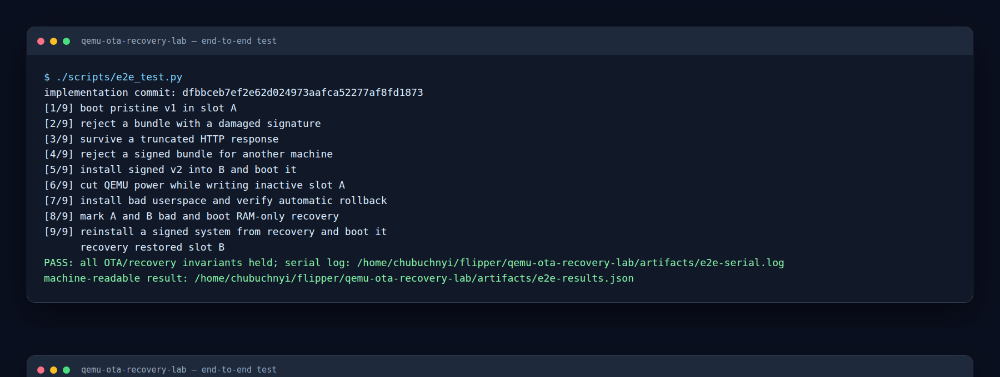
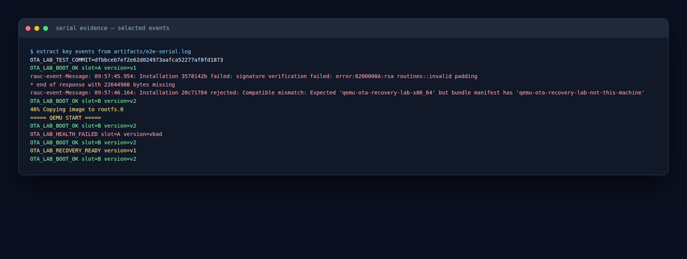

# Lab 1: OTA fault injection

Tested implementation: [`dfbbceb7ef2e62d024973aafca52277af8fd1873`](https://github.com/chubuchnyi/qemu-ota-recovery-lab/commit/dfbbceb7ef2e62d024973aafca52277af8fd1873)

Test environment: QEMU 8.2.2, RAUC 1.15.2, and Buildroot
`93e8f75c559a6efd6d4b503123e4755bb2a49576`.

## Goal

Prove three properties of the update design:

1. An invalid bundle cannot change boot state.
2. Losing power while writing the inactive slot cannot destroy the active slot.
3. A failed first boot rolls back, while two failed slots enter recovery.

RAUC uses a signed manifest `compatible` value to bind a bundle to a target,
and recommends the `verity` bundle format for new designs. See the
[RAUC bundle reference](https://rauc.readthedocs.io/en/latest/reference.html).

## Run it

```console
make test-e2e
```

The first run builds the toolchain. Later runs reuse `output/buildroot` and are
much faster. QEMU uses a temporary qcow2 overlay, so the base image remains
unchanged.



The test writes:

- `artifacts/e2e-serial.log` — complete serial transcript;
- `artifacts/e2e-results.json` — commit, result, and scenario names.

A compact result captured for this article is available as
[`dfbbceb-results.json`](../evidence/dfbbceb-results.json).

## What fails before a slot write

The first three failures happen while RAUC is still validating the input:

| Input | Expected rejection |
|---|---|
| Bundle with one modified signature byte | Signature verification fails |
| HTTP response closed after 1 MiB | Download is incomplete |
| Validly signed bundle with another `compatible` | Target mismatch |

Verbatim serial excerpts:

```text
signature verification failed: error:0200008A:rsa routines::invalid padding
* end of response with 22644908 bytes missing
Compatible mismatch: Expected 'qemu-ota-recovery-lab-x86_64' but bundle manifest has 'qemu-ota-recovery-lab-not-this-machine'
```

After every rejection, the test checks all five relevant GRUB values:

```text
ORDER=A B R
A_OK=1
B_OK=0
A_TRY=0
B_TRY=0
```

RAUC's GRUB integration defines the `ORDER`, `<bootname>_OK`, and
`<bootname>_TRY` interface used here. See the
[RAUC bootloader integration guide](https://rauc.readthedocs.io/en/latest/integration.html#grub).

## Power loss during the write

The harness waits until RAUC starts copying to inactive slot A, then sends the
QMP `quit` command over a Unix socket. QEMU exits without a guest shutdown.
The same qcow2 overlay is booted again.

```text
46% Copying image to rootfs.0
===== QEMU START =====
OTA_LAB_BOOT_OK slot=B version=v2
```

Slot A was marked bad before writing began, so partially written data is never
selected. Slot B and the persistent data marker remain intact. The QMP
handshake and `quit` command follow the official
[QMP protocol](https://www.qemu.org/docs/master/interop/qmp-spec.html) and
[`quit` reference](https://www.qemu.org/docs/master/interop/qemu-qmp-ref.html#command-quit).

## Rollback and recovery

A deliberately broken image reaches userspace but never calls
`rauc status mark-good`. Its first boot sets `A_TRY=1`; the next GRUB pass skips
A and returns to B. Marking both normal slots bad selects the RAM-only recovery,
which then installs a signed system back to B.

```text
OTA_LAB_HEALTH_FAILED slot=A version=vbad
OTA_LAB_BOOT_OK slot=B version=v2
OTA_LAB_RECOVERY_READY version=v1
OTA_LAB_BOOT_OK slot=B version=v2
```



The exact selected lines are stored in
[`dfbbceb-fault-injection.log`](../evidence/dfbbceb-fault-injection.log).

## What this does not prove

This lab authenticates OTA bundles, but the installed ext4 rootfs is still
writable. It does not yet test runtime dm-verity, UEFI Secure Boot, key rotation,
or anti-rollback. Those belong in the hardening lesson after the recovery
invariants are stable.
