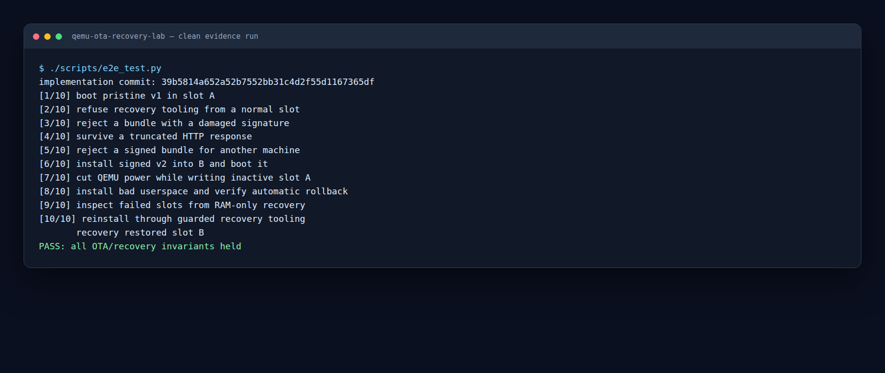
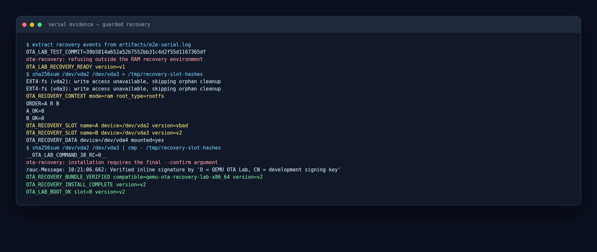

# Lab 2: A guarded recovery workflow

Tested implementation: [`39b5814a652a52b7552bb31c4d2f55d1167365df`](https://github.com/chubuchnyi/qemu-ota-recovery-lab/commit/39b5814a652a52b7552bb31c4d2f55d1167365df)

Test environment: QEMU 8.2.2, RAUC 1.15.2, and Buildroot
`93e8f75c559a6efd6d4b503123e4755bb2a49576`.

## Goal

Turn the RAM-only recovery boot into a small, predictable operator workflow:

1. Refuse accidental use from a normal A/B boot.
2. Inspect both failed slots without changing their bytes.
3. Verify and reinstall a signed bundle only after explicit confirmation.

The command is a safety rail for a root operator, not an authorization boundary.
Root can still invoke RAUC directly.

## Run it

```console
make test-e2e
```



The captured result is
[`39b5814-results.json`](../evidence/39b5814-results.json). The full test also
creates `artifacts/e2e-serial.log` locally.

## Refuse the wrong boot context

`ota-recovery` first checks for `ota.mode=recovery` in the kernel command line.
A normal slot gets no inspection or installation actions:

```text
# ota-recovery status
ota-recovery: refusing outside the RAM recovery environment
__OTA_LAB_COMMAND_4_RC=2__
```

This prevents a copied recovery runbook from silently acting on a running
system. It does not try to replace Unix permissions or RAUC policy.

## Inspect without changing the slots

From recovery:

```console
ota-recovery status
```

The useful output is deliberately machine-readable:

```text
OTA_RECOVERY_CONTEXT mode=ram root_type=rootfs
ORDER=A R B
A_OK=0
B_OK=0
OTA_RECOVERY_SLOT name=A device=/dev/vda2 version=vbad
OTA_RECOVERY_SLOT name=B device=/dev/vda3 version=v2
OTA_RECOVERY_DATA device=/dev/vda4 mounted=yes
```

The command temporarily sets each slot block device read-only, then mounts it
with `ro,noload`. This matters because ext4 may replay its journal—and therefore
write—even for a plain read-only mount. The
[Linux ext4 guide](https://docs.kernel.org/admin-guide/ext4.html) documents
`ro,noload` for this case.

The test hashes both 384 MiB slot partitions before and after inspection and
requires an exact match:

```text
# sha256sum /dev/vda2 /dev/vda3 > /tmp/recovery-slot-hashes
# ota-recovery status
# sha256sum /dev/vda2 /dev/vda3 | cmp - /tmp/recovery-slot-hashes
__OTA_LAB_COMMAND_38_RC=0__
```

The kernel also confirms that orphan cleanup could not write:

```text
EXT4-fs (vda2): write access unavailable, skipping orphan cleanup
EXT4-fs (vda3): write access unavailable, skipping orphan cleanup
```



## Reinstall with explicit confirmation

The incomplete command is rejected:

```text
# ota-recovery install http://10.0.2.2:8000/update-v2.raucb
ota-recovery: installation requires the final --confirm argument
```

The intentional form is:

```console
ota-recovery install http://10.0.2.2:8000/update-v2.raucb --confirm
```

The wrapper downloads remote bundles to RAM, runs `rauc info` using the system
keyring, checks the signed `compatible` value, and then calls `rauc install`.
RAUC documents both authenticated bundle inspection and installation in its
[command-line guide](https://rauc.readthedocs.io/en/latest/using.html).

```text
Verified inline signature by 'O = QEMU OTA Lab, CN = development signing key'
OTA_RECOVERY_BUNDLE_VERIFIED compatible=qemu-ota-recovery-lab-x86_64 version=v2
OTA_RECOVERY_INSTALL_COMPLETE version=v2
OTA_LAB_BOOT_OK slot=B version=v2
```

The selected verbatim lines are stored in
[`39b5814-recovery-workflow.log`](../evidence/39b5814-recovery-workflow.log).

## Limits kept outside this lesson

- HTTP transport is not authenticated; the signed RAUC bundle is. HTTPS is
  supported when transport authentication is needed.
- `--confirm` prevents an operator typo, not a malicious root process.
- Filesystem repair, factory reset, key rotation, Secure Boot, and runtime
  dm-verity remain separate exercises.
