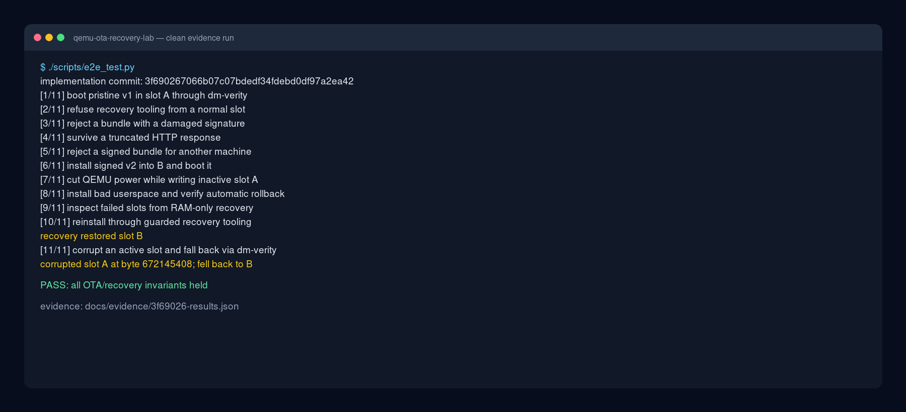
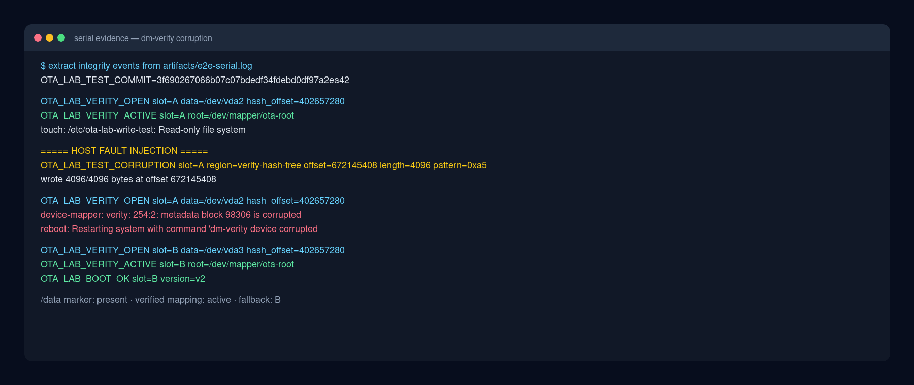

# Lab 3: Runtime rootfs integrity with dm-verity

Tested implementation: [`3f690267066b07c07bdedf34fdebd0df97a2ea42`](https://github.com/chubuchnyi/qemu-ota-recovery-lab/commit/3f690267066b07c07bdedf34fdebd0df97a2ea42)

Test environment: QEMU 8.2.2, RAUC 1.15.2, Linux 6.18.7, and Buildroot
`93e8f75c559a6efd6d4b503123e4755bb2a49576`.

## Goal

Prove three properties:

1. Normal A/B roots are read-only dm-verity mappings.
2. A signed OTA installs its matching hash tree and updates the target slot's
   root hash.
3. Corruption detected before userspace causes a reboot and fallback to the
   intact slot.

This is runtime block integrity. It is not yet an authenticated boot chain.

## Run it

```console
make test-e2e
```



The clean run is captured in
[`3f69026-results.json`](../evidence/3f69026-results.json). The complete local
transcript is `artifacts/e2e-serial.log`.

## Image and boot path

Each A/B partition is one raw image:

```text
384 MiB ext4 data | 4 KiB gap | verity header | SHA-256 Merkle tree
```

The build uses format 1 and 4 KiB data/hash blocks. `veritysetup format`
appends the tree and emits a 64-character root hash. Linux permits the data and
hash areas on one device when the tree is outside the mapped data range; the
mapping then verifies blocks on demand. See the
[kernel dm-verity documentation](https://www.kernel.org/doc/html/latest/admin-guide/device-mapper/verity.html)
and [`veritysetup(8)`](https://man7.org/linux/man-pages/man8/veritysetup.8.html).

The normal boot path is deliberately small:

```text
GRUB -> kernel + initramfs -> ota-verity-init -> /dev/mapper/ota-root -> init
```

GRUB passes the selected slot's device, hash offset, and root hash. The early
initramfs opens dm-verity with `--restart-on-corruption`, mounts the mapping
read-only, and uses `switch_root`.

RAUC treats A and B as `raw` slots. This is important: mounting ext4 in a
post-install hook could replay its journal and immediately invalidate the hash
tree. Instead, a hook carried inside the signed bundle writes the new slot's
root hash to `grubenv` only after the raw image copy succeeds. RAUC documents
these slot hooks in its
[manifest reference](https://rauc.readthedocs.io/en/latest/reference.html).

## Prove the normal root is verified

The first boot reports the mapping before userspace starts:

```text
OTA_LAB_VERITY_OPEN slot=A data=/dev/vda2 hash_offset=402657280
device-mapper: verity: sha256 using "sha256-lib"
EXT4-fs (dm-0): mounted filesystem 13944596-76e0-4aa3-ac86-a7cd98697fc0 ro with ordered data mode. Quota mode: disabled.
OTA_LAB_VERITY_ACTIVE slot=A root=/dev/mapper/ota-root
```

The harness checks `veritysetup status`, confirms `/` is backed by
`/dev/mapper/ota-root`, and verifies that a write fails:

```text
# touch /etc/ota-lab-write-test
touch: /etc/ota-lab-write-test: Read-only file system
__OTA_LAB_COMMAND_5_RC=1__
```

Writable runtime paths `/run`, `/tmp`, and `/mnt` use tmpfs. Persistent state
lives on `/data`, outside the replaceable A/B roots.

## Corrupt the active slot

The test first installs v2 into both slots and boots A successfully. It then
stops QEMU through QMP and uses `qemu-io` against the qcow2 overlay:

```text
OTA_LAB_TEST_CORRUPTION slot=A region=verity-hash-tree offset=672145408 length=4096 pattern=0xa5
wrote 4096/4096 bytes at offset 672145408
```

The fault targets a Merkle-tree block, not ext4. GRUB must still be able to
read A's kernel so the dm-verity path itself gets tested. On the next boot:

```text
OTA_LAB_VERITY_OPEN slot=A data=/dev/vda2 hash_offset=402657280
device-mapper: verity: 254:2: metadata block 98306 is corrupted
reboot: Restarting system with command 'dm-verity device corrupted'
OTA_LAB_VERITY_OPEN slot=B data=/dev/vda3 hash_offset=402657280
OTA_LAB_VERITY_ACTIVE slot=B root=/dev/mapper/ota-root
OTA_LAB_BOOT_OK slot=B version=v2
```



GRUB records `A_TRY=1` before entering A. The dm-verity restart therefore
cannot loop on A: the next selection skips it and boots healthy B. The `/data`
marker is checked again after fallback.

The selected verbatim lines are stored in
[`3f69026-dm-verity.log`](../evidence/3f69026-dm-verity.log). The fault command
uses the official [`qemu-io`](https://www.qemu.org/docs/master/devel/multi-process.html)
disk I/O tool.

## Trust boundary and next lesson

dm-verity requires a trusted root hash. In this milestone, `grubenv`, the
kernel command line, GRUB, and the per-slot kernel are not authenticated, and
the EFI partition remains writable. Someone who controls the disk can replace
both the payload and its expected hash. The test therefore proves fail-closed
corruption handling when boot metadata remains trusted; it does not prove
resistance to a malicious disk rewrite.

The next hardening lesson must authenticate the boot path and root hash with
UEFI Secure Boot or an equivalent signed-kernel design. Production key
handling, key rotation, and anti-rollback also remain separate exercises.
